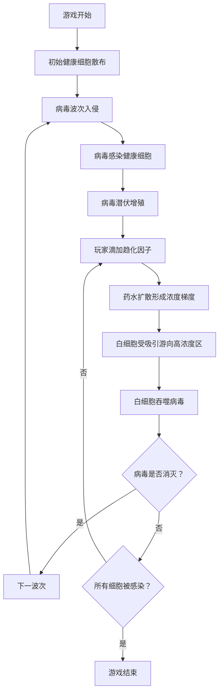

## 1. 产品概述

微观视角的免疫系统防御即时战略游戏，玩家扮演免疫系统中枢，通过滴加化学趋化因子引导白细胞大军围剿病毒。

- **核心玩法**：非直接操控的即时战略，通过化学信号引导群体行为
- **目标用户**：休闲策略游戏爱好者、生物科普爱好者
- **产品价值**：寓教于乐，展示群体智能和扩散动力学的魅力

## 2. 核心功能

### 2.1 用户角色

| 角色 | 登录方式 | 核心权限 |
|------|----------|----------|
| 玩家 | 直接进入 | 完整游戏体验 |

### 2.2 功能模块

1. **游戏主界面**：Canvas 游戏画布、HUD 信息面板、药水选择栏
2. **扩散场系统**：化学趋化因子的扩散与衰减模拟
3. **群体 AI 系统**：Boids 算法驱动的白细胞集群行为
4. **敌人系统**：病毒的感染、潜伏、增殖机制
5. **战斗系统**：白细胞吞噬病毒、细胞健康度管理

### 2.3 页面详情

| 页面名称 | 模块名称 | 功能描述 |
|----------|----------|----------|
| 游戏主界面 | Canvas 画布 | 微观世界渲染，实时显示细胞、病毒、药水扩散效果 |
| 游戏主界面 | HUD 面板 | 显示存活细胞数、白细胞数、病毒数、当前波次 |
| 游戏主界面 | 药水选择栏 | 3 种趋化因子选择，点击画布施放 |
| 游戏主界面 | 开始/暂停 | 游戏控制按钮 |

## 3. 核心流程

游戏开始 → 健康细胞散布在地图上 → 病毒从边缘入侵 → 病毒感染健康细胞并潜伏增殖 → 玩家滴加趋化因子 → 白细胞受浓度梯度吸引 → 白细胞包围并吞噬病毒 → 循环直至所有细胞被感染或病毒被消灭

## 4. 用户界面设计

### 4.1 设计风格

- **主色调**：深海蓝背景（模拟体液环境），荧光绿/橙/紫（不同趋化因子）
- **辅助色**：白色半透明（白细胞）、红色（病毒）、淡粉色（健康细胞）
- **视觉风格**：生物荧光显微镜效果，半透明粒子感，柔和的光晕
- **字体**：科技感无衬线字体，清晰易读
- **动效**：药水扩散波纹、细胞蠕动、吞噬闪光

### 4.2 页面设计概览

| 页面名称 | 模块名称 | UI 元素 |
|----------|----------|----------|
| 游戏主界面 | Canvas 画布 | 深蓝色背景、荧光粒子效果、细胞/病毒实体、扩散场可视化 |
| 游戏主界面 | HUD 面板 | 半透明深色面板、图标+数字、顶部悬浮 |
| 游戏主界面 | 药水选择栏 | 底部横向排列、彩色圆形按钮、选中高亮 |
| 游戏主界面 | 控制按钮 | 右上角、简约图标按钮 |

### 4.3 响应式设计

桌面端优先，Canvas 自适应窗口大小，UI 元素相对定位。

### 4.4 视觉特效指引

- **环境**：深蓝色流体背景，细微颗粒漂浮模拟体液
- **光照**：生物荧光自发光效果，细胞和病毒有柔和光晕
- **镜头**：固定俯视视角，全屏微观世界
- **构图**：中心为主要战场，HUD 环绕边缘
- **交互**：点击施放药水有波纹扩散动画，吞噬有粒子爆发效果
- **后处理**：整体偏蓝绿色调，模拟荧光显微镜观察效果
