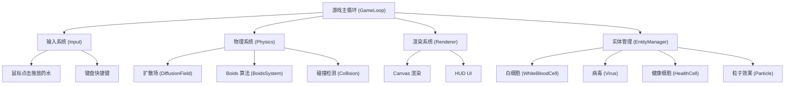

## 1. 架构设计



## 2. 技术说明

- **前端**：原生 JavaScript (ES6+) + HTML5 Canvas
- **构建工具**：无（纯静态文件，直接运行）
- **后端**：无（纯客户端游戏）
- **数据库**：无
- **性能优化**：空间网格索引（Spatial Grid）用于 Boids 邻居搜索

## 3. 文件结构

| 文件 | 用途 |
|------|------|
| `index.html` | 游戏入口页面，包含 Canvas 和 UI 容器 |
| `css/style.css` | 页面样式，HUD 和 UI 元素样式 |
| `js/main.js` | 游戏入口，初始化和主循环 |
| `js/config.js` | 游戏配置参数 |
| `js/diffusion.js` | 扩散场系统（网格扩散方程） |
| `js/boids.js` | Boids 集群算法 |
| `js/entities.js` | 游戏实体类（白细胞、病毒、细胞） |
| `js/particles.js` | 粒子特效系统 |
| `js/renderer.js` | Canvas 渲染器 |
| `js/input.js` | 输入处理（鼠标、键盘） |
| `js/utils.js` | 工具函数 |

## 4. 核心数据结构

### 4.1 扩散场 (DiffusionField)

- **网格大小**：可调，默认 10-20 像素一格
- **数据结构**：二维 Float32Array 存储浓度值
- **扩散算法**：有限差分法求解扩散方程
- **衰减**：随时间指数衰减
- **类型**：3 种趋化因子，各自独立的浓度场

### 4.2 白细胞 (WhiteBloodCell)

```javascript
{
  x, y: number,        // 位置
  vx, vy: number,      // 速度
  radius: number,      // 半径
  speed: number,       // 最大速度
  health: number,      // 生命值
  type: 'neutrophil'|'macrophage'|'lymphocyte',  // 类型
  state: 'wandering'|'chasing'|'attacking',     // 状态
}
```

### 4.3 病毒 (Virus)

```javascript
{
  x, y: number,        // 位置
  vx, vy: number,      // 速度
  radius: number,      // 半径
  health: number,      // 生命值
  state: 'free'|'infecting'|'latent'|'replicating',  // 状态
  hostCell: Cell|null, // 宿主细胞
  latencyTimer: number,// 潜伏计时器
}
```

### 4.4 健康细胞 (HealthCell)

```javascript
{
  x, y: number,        // 位置
  radius: number,      // 半径
  health: number,      // 健康度 0-100
  infected: boolean,   // 是否被感染
  infectionTimer: number, // 感染进度
  virusCount: number,  // 内部病毒数量
}
```

## 5. 核心算法

### 5.1 扩散方程

使用有限差分法求解二维扩散方程：

```
∂C/∂t = D * (∂²C/∂x² + ∂²C/∂y²) - k * C
```

其中：
- D 为扩散系数
- k 为衰减系数
- 离散化使用五点差分格式

### 5.2 Boids 三准则

1. **排斥 (Separation)**：避免与邻近个体碰撞
2. **对齐 (Alignment)**：与邻近个体速度方向保持一致
3. **内聚 (Cohesion)**：向邻近个体的中心位置移动

### 5.3 趋化性

白细胞的速度向量受浓度梯度影响：
- 计算当前位置的浓度梯度（∇C）
- 将梯度方向加权叠加到 Boids 速度上
- 浓度越高，趋化性权重越大

### 5.4 黏滞阻力

模拟细胞质的黏糊糊感：
- 速度更新时加入阻尼项
- `v = v * (1 - drag * dt)`
- drag 为阻力系数，模拟流体黏性
